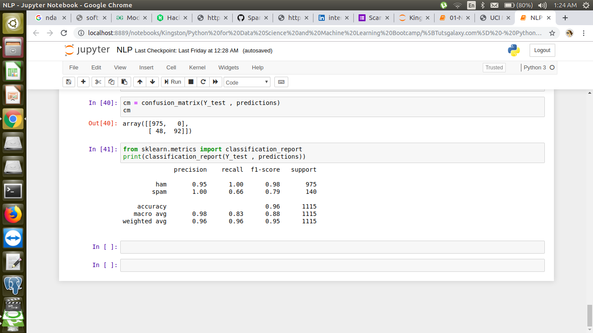

# Spam-ham
The aim is to classify the mails in to 2 categories : Spam and Ham
The dataset : https://archive.ics.uci.edu/ml/datasets/SMS+Spam+Collection
## The techniques used:
   1. NLP : Natural Language Processing 
   2. Machine learnoing Algorithm to classify
## Imports
  1. Nltk(Natural Language toolkit): for Language Processing such as removal of punctuations , stemming etc .
  2. String: for removal of spl. characters 
  3. Matplotlib and seaborn : For visualisation
  4. Pandas : To read the dataset
  5. Sklearn : For classification Algorithm.
# Classification report

